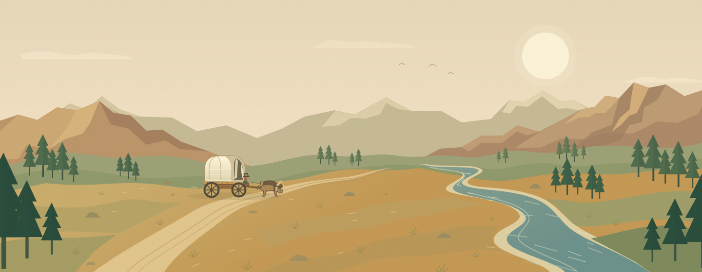

# Westward — The Oregon Trail

An original browser survival game inspired by The Oregon Trail. Lead five travelers from Independence to Oregon City across a 2,040-mile, illustrated frontier.



## Play locally

Requires **Node.js 24+** and npm.

```bash
npm ci
npm run dev
```

Open the address printed by Vite. An expedition is ready immediately. Choose **New expedition** to name your party and select a farmer, carpenter, or banker.

## On the trail

- **Travel** advances three days. Pace, weather, oxen, and wagon condition determine the distance.
- **Manage provisions.** Filling meals preserve health; reduced rations stretch food at a health cost.
- **Make camp** to recover, use medicine to tend your party, and repair the wagon with spare parts.
- **Hunt** in a keyboard-accessible, timed minigame. A hunt takes one day and five cartridges; click the deer or focus it and use Enter or Space. Ending early still consumes the day and ammunition.
- **Cross rivers** by fording, caulking, or paying for a ferry. Caulking takes two days; other crossings take one. Ferries offer safe passage.
- **Trade** with passing traders at any point along the route. Food, ammunition, medicine, parts, and oxen have fixed, visible prices.
- **Reach Oregon** with survivors before winter closes the mountain passes. Losing the whole party, the oxen, or the wagon also ends the journey.

The trail map shows landmarks, and the journal records decisions and events. Download the journal as a text keepsake. Expeditions save automatically in browser local storage after each decision. A new expedition replaces the existing save; saves are specific to the browser and site address. Blocked storage falls back to session-only play with a visible notice.

## Build and verify

```bash
npm test                       # Deterministic engine and save-validation tests
npm run build                 # Strict TypeScript check and production build
npx playwright install chromium
npm run test:e2e               # Desktop/mobile browser interaction tests
npm run check                 # All checks (browser must be installed)
npm run preview               # Serve the production build locally
```

The browser suite starts its own server on port 4173. Production output is in `dist/` and can be served by a static host at the domain root. No backend or API keys are required. Fonts and illustrations are bundled locally.

## Implementation

- TypeScript and Vite; no UI framework or game engine dependency.
- Immutable game state and a seeded random-event generator in `src/game.ts`.
- DOM-based, responsive interface with native dialogs and reduced-motion support.
- Original SVG landscape and icons, plus locally bundled DM Sans and DM Serif Display fonts (SIL Open Font License, distributed through Fontsource).
- Runtime validation rejects malformed or inconsistent saved expeditions.

The setting is fictionalized and the route simplified. The game is an independent homage, not affiliated with the owners of The Oregon Trail, and is not a comprehensive historical account.

## License

Project code and original artwork are provided under the [MIT license](LICENSE). Bundled third-party fonts retain their own licenses.
